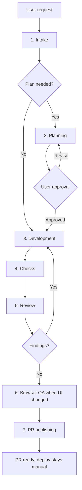

# DDC CRM Agent Loop

This skill coordinates DDC CRM work from request to pull request. It covers the React 19 admin SPA (`client/`) and the Express 5 + Prisma API (`server/`). Deployment stays manual and outside the loop — the repo owner runs `npm run deploy`.

## Standing Inputs

Before every loop, read:

- `AGENTS.md` for repository guardrails, commands, and the completion bar.
- `CONTEXT.md` for current domain language, architecture, and project-specific details.
- `README.md` for setup, secrets, media, and operational notes.
- The relevant local roadmap (gitignored `docs/roadmap/`, machine-local only) when auth/security, invoices, organizations, brands, or payment reminders are touched.

Treat `AGENTS.md` as the source of truth when another `.agents/` file disagrees with it.

## Flow

## Coordinator Rules

The coordinator owns orchestration, status, review, and publishing. During the development phase, delegate code edits to a development subagent when subagents are available. If subagents are unavailable, perform the same loop directly and keep task boundaries small.

Work incrementally. Keep unrelated refactors, seed-data churn, uploads, and styling churn out of scope unless the request requires them.

## 1. Intake

Classify the request:

- **Tiny:** obvious one-file or config/copy change. Skip written planning and execute a tight loop.
- **Standard:** feature or bugfix touching several files. Use planning.
- **Risky:** auth/security, invoices, payments (Mollie), email workflows, organizations/brands, schema changes, release/publish work, or broad styling. Use planning and, when user-facing, browser QA.

Check:

- Current branch and worktree: `git status --short --branch`.
- Whether existing user changes overlap the task (AGENTS.md requires keeping unrelated user changes intact).
- Whether the diff is purely client, purely server, or cross-cutting — this picks the check commands.
- Which local roadmaps (gitignored `docs/roadmap/`) constrain the area.

Completion criterion: scope, risks, and required skills are known.

## 2. Planning

Use `planning-and-task-breakdown` for Standard and Risky work. Save:

- `tasks/plan.md`
- `tasks/todo.md`

Plans must include DDC CRM verification commands, likely files, acceptance criteria, and whether browser QA is required. Ask for user approval before implementation when a plan file is created.

Completion criterion: every task is small, ordered, testable, and approved.

## 3. Development

Use `tdd` for feature and bugfix logic. Choose public seams from the project surface:

Client (`client/`):

- Redux slices and selectors in `client/src/**/model/`.
- React components and their SCSS Modules (`*.module.scss`) under Feature-Sliced Design layers.
- Requests through `@/shared/api/api.ts` (`$api` / `$apiPrivate`).

Server (`server/`):

- Services in `server/src/services/`, exposed via `controllers/` and `routes/`.
- Validation schemas in `server/src/schemas/`.
- Prisma models in `server/prisma/schema/*.prisma`.

For each task:

1. Create or update the narrowest meaningful test first when the repo supports it (Jest for client, Node test runner for server).
2. Implement only the current task.
3. Run the task verification.
4. Mark the task complete in `tasks/todo.md` when present.

Completion criterion: the task is implemented, locally checked, and represented accurately in `tasks/todo.md`.

## 4. Checks

Run checks matched to the changed surface:

Client, from `client/`:

- `npm run lint:ts`
- `npm run lint:scss` when SCSS changed
- `npm test`
- `npm run build:prod` when a production build concern arises

Server, from `server/`:

- `npm run build` (runs `prisma:generate` then `tsc`)
- `npm run prisma:generate` when any Prisma schema file changed
- The matching domain test: `test:auth`, `test:mollie`, `test:search`, `test:email`, `test:payment-reminders`, or a direct `node --test -r ts-node/register src/...test.ts`

From the root, before considering the loop green: `npm run ci` (mirrors GitHub Actions).

Standing scans:

- Secret/media scan: ensure staged files do not include `.env`, credentials, private uploads, `.DS_Store`, or `node_modules/`.
- Brand scan when public copy changed: confirm `Talent Center DDC` / `DDC NL` terminology from `CONTEXT.md`.

Completion criterion: every relevant check passes or the remaining failure is documented as a blocker.

## 5. Review

Use `code-review` against `develop...HEAD` by default unless the user names another fixed point. Review both:

- **Standards:** `AGENTS.md`, local conventions, FSD rules, security/media rules, and code smells.
- **Spec:** the user request plus any `tasks/plan.md` acceptance criteria.

If review finds actionable issues, return to Development with the report and rerun checks.

Completion criterion: review reports no blocking Standards or Spec findings.

## 6. Browser QA

Use `e2e-test` when client UI, forms, front-end JavaScript, or styling changed. Prefer the running SPA (`npm start` from the root, client on `:3000`) and verify desktop and mobile viewports when layout is touched. For server API behavior with no UI, confirm the relevant domain tests and, when safe, a live request against the dev API.

Completion criterion: changed user-facing flows render without obvious broken layout, console errors, or failed core interactions.

## 7. PR Publishing

Use `pull-request` for branch, commit, push, and PR creation into `develop`. Publishing stops at the PR unless the user explicitly requests a release (merge `develop` into `main`) or a deploy.

Before PR:

- Run `git status --short --branch`.
- Inspect staged and unstaged diffs.
- Reconfirm no secrets/private uploads are staged.
- Use Conventional Commits; follow `commit-message-instructions.md`.
- Do not add AI attribution trailers.

Completion criterion: the PR URL is returned to the user, or authentication/network failure is reported with the exact next step.

## Deployment

Deployment is intentionally manual and stays out of the loop. The repo owner runs `npm run deploy` from their own machine; GitHub Actions only runs CI. Do not wire generation or deploy automation into this loop.
