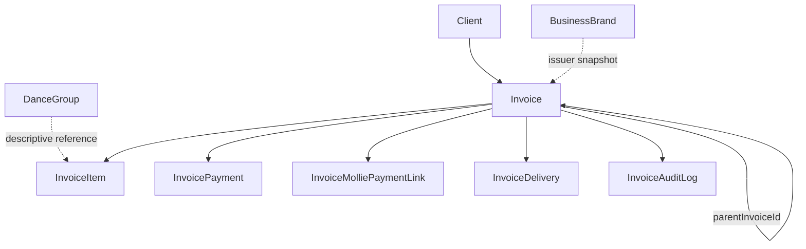

# Billing Domain

## Purpose

Manage the invoice lifecycle: issuing, tracking payment status, adjustments (credit/debit notes),
delivery (email + public link), and reminders for unpaid invoices.

## Scope

- `Invoice`, `InvoiceItem`, `InvoicePayment`, `InvoiceDelivery`, `InvoiceAuditLog`.
- `InvoiceMolliePaymentLink` — schema-owned here, populated/reconciled by the Payments domain.

## Out of Scope

- The Mollie sync mechanism itself, webhook processing, and the Mollie `Payment` model — owned by
  Payments (Billing's `modules/invoices/invoices.mollie.service.ts` reads Payments-domain tables to
  reconcile, but doesn't own the sync).
- **Recurring-subscription payment reminders** — a completely separate mechanism owned by
  Payments (`PaymentReminderDelivery`, tied to `Subscription.nextPaymentDate`). Billing's own
  reminders (`REMINDER_BEFORE_DUE`/`REMINDER_OVERDUE`) are about unpaid *invoice* balances only.
  See the disambiguation in [GLOSSARY.md](GLOSSARY.md).
- Brand/legal-entity management (Organization) — Billing only snapshots issuer fields at
  creation/update time; it doesn't manage brands.
- Pricing computation from `DanceGroup.lessonPriceCents` — line prices are supplied directly by
  the caller, not computed server-side from Scheduling data.

## Entities

### Invoice

- **Purpose**: a billing document issued to a client (or a free-text bill-to party — a `Client`
  record is not required).
- **Identity**: `id`; `number` unique (see numbering below).
- **Important fields**: `documentType` (`INVOICE`/`CREDIT_NOTE`/`DEBIT_NOTE`), `status`,
  `clientId` (optional), `businessBrandId`, `parentInvoiceId` (self-relation for adjustments),
  `totalCents`, `paidAmountCents`, `creditedAmountCents`, `balanceDueCents`, `issuerName`/etc.
  (a point-in-time snapshot of the issuing brand/org, not a live join).
- **Relationships**: `Client` (optional, `SetNull` on delete — invoice survives client deletion),
  `BusinessBrand` (issuer snapshot source), `InvoiceItem[]`, `InvoicePayment[]`,
  `InvoiceMolliePaymentLink[]`, `Payment[]` (Mollie), `InvoiceDelivery[]`, `InvoiceAuditLog[]`,
  self-relation `parentInvoice`/`adjustments`.
- **States**: `DRAFT` → `ISSUED` → `PARTIALLY_PAID` → `PAID` / `OVERDUE` / `CANCELLED`. **Status
  is derived and recomputed on every mutation**, not a freely-set authoritative field:
  ```
  CANCELLED            → stays CANCELLED (terminal)
  balanceDueCents = 0  → PAID
  status = DRAFT        → DRAFT
  dueDate < now          → OVERDUE
  paid or credited > 0    → PARTIALLY_PAID
  otherwise                → ISSUED
  ```
  **Needs clarification**: two near-duplicate implementations of this calculation exist
  (`modules/invoices/invoices.controller.ts` and `invoices.mollie.service.ts`) with a subtle
  divergence in the CANCELLED guard — treat this as a documented inconsistency, not a single
  canonical rule, until reconciled in code.
  A daily cron (09:00) batch-marks `ISSUED`/`PARTIALLY_PAID` invoices with a past `dueDate` and
  `balanceDueCents > 0` as `OVERDUE`.
- **Invariants**:
  - `balanceDueCents` is always clamped to a minimum of 0.
  - "Financially locked" (non-`INVOICE` document type, `PAID`, `CANCELLED`, or any payment/credit
    applied) blocks further content edits. A full `PUT` edit is only possible while status is
    `DRAFT` or `ISSUED` and nothing has been paid/credited.
  - Numbering: `{PREFIX}-{year}-{seq}` (e.g. `INV-2026-001`), prefix by document type
    (`INV`/`CRN`/`DBN`). Sequence is derived from the last matching number for that year, not a DB
    sequence — a race condition under concurrent creates is possible and not addressed in code.

### InvoiceItem

- **Purpose**: a line item on an invoice.
- **Identity**: `id`; belongs to one `Invoice`.
- **Important fields**: `description`, `quantity`, `unitPriceCents`, `totalCents`,
  `groupId` (optional, `SetNull` on delete).
- **Invariants**: `groupId` is a **descriptive reference only** — `unitPriceCents` is always
  caller-supplied, never computed from `DanceGroup.lessonPriceCents`.

### InvoicePayment

- **Purpose**: a manually recorded payment applied to an invoice's balance (distinct from a
  Mollie `Payment` and from the internal `Transaction` ledger — see [GLOSSARY.md](GLOSSARY.md)).
- **Identity**: `id`; belongs to one `Invoice`.
- **Important fields**: `amountCents`, `paidAt`, `method`, `reference`.
- **Invariants**: rejected if the invoice is a `CREDIT_NOTE`, is `DRAFT`/`CANCELLED`, or the
  amount exceeds the current `balanceDueCents`. Recording a payment recomputes
  `paidAmountCents`/`balanceDueCents`/status.

### InvoiceDelivery

- **Purpose**: a record of one email delivery attempt (initial send, resend, or reminder) and its
  public-view tracking.
- **Identity**: `id`; `publicToken` unique (32-byte random hex, no expiry on the token itself).
- **Important fields**: `type` (`INITIAL`/`RESEND`/`REMINDER_BEFORE_DUE`/`REMINDER_OVERDUE`),
  `status` (`PENDING`/`SENT`/`FAILED`), `viewCount`, `firstViewedAt`, `lastViewedAt`.
- **Invariants**: the public invoice view (`GET /public/:token`) is authenticated solely by
  possession of this token — no session required. Reminders are deduplicated: the daily reminder
  job skips an invoice if a `SENT` delivery of the same reminder type already exists for today.
  **Notable**: outbound invoice email is sent through Billing's **own independent SMTP transport**
  (built directly from env vars), entirely separate from the Communication domain's
  `EmailAccount`-based sending — they share no code.

### InvoiceAuditLog

- **Purpose**: append-only change history for an invoice (action + before/after JSON snapshot).
- **Identity**: `id`; belongs to one `Invoice`.
- **Note**: distinct from Identity's security audit log (`AuthSecurityEvent`) — this one is
  domain/business history, not a security event stream.

## Domain Concepts

- **Issuer Snapshot**: at invoice creation/update, `BusinessBrand`/`LegalOrganization` fields are
  copied into the invoice's own `issuer*` columns — a point-in-time copy, not a live reference.
  Changing a brand later does not alter past invoices.
- **Credit note vs debit note — asymmetric behavior**: adjustments are only allowed on an
  `INVOICE` document that is neither `DRAFT` nor `CANCELLED`. A **credit note** creates a new
  `PAID` invoice row referencing the parent and *also* applies itself to the parent — increasing
  `creditedAmountCents` (capped so cumulative credits never exceed the parent's total) and
  recomputing the parent's balance/status; existing Mollie payment links on the parent are
  archived first. A **debit note** creates a standalone `ISSUED` invoice referencing the parent
  via `parentInvoiceId` but does **not** touch the parent's balance at all — it's a separate
  billable document, not a balance adjustment, despite sharing one API endpoint with credit notes.
- **Money**: all monetary fields are integer cents (`*Cents`), never floats.

## Relationships


