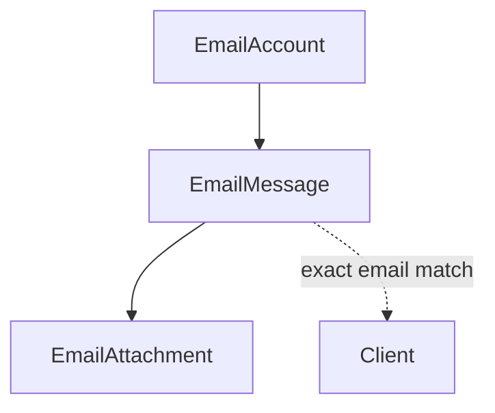

# Communication Domain

## Purpose

Staff email mailbox integration (IMAP sync + SMTP send) linked to clients, plus an Instagram
webhook endpoint and an internal Telegram notification utility.

## Scope

- `EmailAccount`, `EmailMessage`, `EmailAttachment`.
- Instagram webhook handling (`modules/communication/instagram/instagram.controller.ts`).
- Telegram notification sending (`modules/communication/telegram/telegram.service.ts`).

## Out of Scope

- **Invoice delivery email** — Billing has its own independent SMTP transport
  (`modules/invoices/invoices.delivery.service.ts`, built directly from env vars), sharing no code
  with this module; invoice emails never create an `EmailMessage` row here.
- **2FA email** — Identity sends 2FA codes directly via nodemailer using the `EmailAccount` whose
  `username` matches `TWO_FACTOR_SENDER_EMAIL`, bypassing this module's send path and not creating
  an `EmailMessage`.
- **Payment reminder email content** — templated and sent by the Payments domain
  (`PaymentReminderTemplate`).

## Entities

### EmailAccount

- **Purpose**: a staff-configured IMAP+SMTP mailbox.
- **Identity**: `id`.
- **Important fields**: `imapHost`/`imapPort`/`smtpHost`/`smtpPort`, `username`,
  `passwordEncrypted`, `lastSyncedUid`/`lastSyncedAt` (sync cursor).
- **Invariants**: the entire `/email` API is `ADMIN`-only (Identity-domain rule enforced at the
  router level) — `MANAGER`/`DOCTOR` staff cannot access email at all.

### EmailMessage

- **Purpose**: one email, inbound or outbound.
- **Identity**: `id`; unique on `(mailboxId, imapUid)`.
- **Important fields**: `isOutgoing`, `isRead` (outgoing mail is always written as read),
  `fromAddress`, `clientId` (optional), `messageId`/`inReplyToMessageId` (stored from the IMAP
  envelope, but not used to group/display threads in the reviewed code).
- **Relationships**: `EmailAccount` (mailbox), optional `Client` — associated by **exact email
  address match** only (`Client.email === fromAddress`), nothing fuzzier.
- **Invariants**: deletion is a two-step process, not a plain cascade — attachment files are
  removed from disk explicitly before the DB row delete (which then cascades `EmailAttachment`
  rows). Delete/spam actions first attempt to move the message on the IMAP server, unless it's an
  outgoing message that never existed there.

### EmailAttachment

- **Purpose**: a file attached to an `EmailMessage`.
- **Identity**: `id`.
- **Important fields**: `storagePath` — files are stored under a **UUID filename**, deliberately
  decoupled from the original filename to avoid path traversal (same pattern used for client image
  uploads in the CRM domain).

## Domain Concepts

- **IMAP sync**: runs on a 5-minute cron plus a manual per-account trigger; both funnel through the
  same sync function, which guards against overlapping runs on the same account. Fetches only UIDs
  newer than `lastSyncedUid`, upserts each into `EmailMessage`, and advances the sync cursor to the
  highest UID seen — even on partial failure within the batch.
- **Sending**: composing or replying sends via nodemailer using the target mailbox's own SMTP
  credentials, then synchronously writes the `EmailMessage` row in the same call. A reply always
  goes out through the mailbox that received the original message, not an arbitrary sender.
- **Encryption scope**: `EmailAccount.passwordEncrypted` is AES-256-GCM encrypted at rest. Message
  bodies (`bodyText`/`bodyHtml`) and attachment files are stored **unencrypted** (attachments are
  kept outside the public static mount, but not encrypted).
- **Instagram — stub, not a working feature**: the webhook handshake (GET, HMAC-verified) is
  functional, but the message-receiving handler only logs incoming events — it does not persist
  anything or associate with a `Client`. Document as scaffolding, not active client communication.
  It's also the only fully unauthenticated, CSRF-exempt API surface besides `/health`.
- **Telegram — internal ops notification, not a customer channel**:
  `modules/communication/telegram/telegram.service.ts` exposes several `notify*()` functions
  (`notifyMolliePayment`, `notifyLoginBlocked`, `notifyNewDeviceAfterFailures`,
  `notifyRoleChanged`, `notifyNewEmail`), each gated on Telegram being configured and each
  fire-and-forget (a Telegram send failure never affects the triggering action's own response).
  Callers span three other domains: Payments (Mollie webhook: paid/failed/canceled/expired/
  chargeback/refund), Identity (login-blocked, new-device-after-failures, role-changed), and this
  module's own IMAP sync (new non-spam email). Two distinct recipients, not one: `TELEGRAM_CHAT_ID`
  (the shared admin group — every notifier above except `notifyNewEmail`) vs.
  `TELEGRAM_EMAIL_NOTIFY_CHAT_ID` (one admin's own private chat with the bot —
  `sendTelegramMessage`'s `chatId` option overrides the group default). This is a separate
  integration from the Telegram Mini App admin tool (`auth/telegram-miniapp/` +
  `telegram-admin-bot/`, documented in [identity.md](identity.md) — Mini App auth is genuinely
  Identity's concern) and from Telegram OIDC login (also identity.md).

## Relationships

