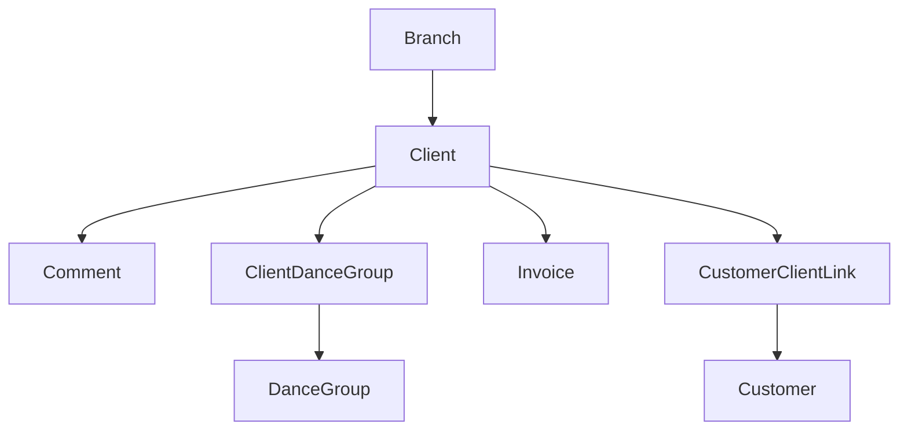

# CRM Domain

## Purpose

Manage client (student/payer) records: personal info, branch assignment, group enrollment, staff
notes, and cross-domain search.

## Scope

- `Client` — student or parent/payer record.
- `ClientStatus` — loyalty tracking (see note below — currently unused in code).
- `Comment` — staff notes attached to a client.
- Global search (cross-domain, but rooted in and primarily about finding a client).

## Out of Scope

- Group/class definitions (Scheduling owns `DanceGroup`; CRM only writes the *membership* rows —
  see the enrollment note below).
- Invoicing (Billing).
- Payment processing itself (Payments) — CRM only reads Payments-domain tables to produce a
  derived payment-status summary for display.
- Branch/legal-entity/brand management (Organization) — CRM only stores a `branchId` reference.

## Entities

### Client

- **Purpose**: a student, or their parent/guardian who pays.
- **Identity**: `id`.
- **Important fields**: `firstName`/`lastName` (at least one required), `birthday` (cannot be in
  the future), `phoneNumber`, `email`, `branchId`, `preferredLanguage`.
- **Relationships**: `Branch` (Organization), `ClientDanceGroup[]` → `DanceGroup` (Scheduling),
  `Comment[]`, `Invoice[]` (Billing), `Customer`/`CustomerClientLink` (Payments), `EmailMessage[]`
  (Communication, matched by exact email address).
- **States**: none — no active/archived status is used in current code, despite `ClientStatus`
  existing as a model (see Domain Concepts).
- **Invariants**:
  - Create/update requires `firstName` or `lastName`; birthday, if set, cannot be in the future.
  - Any `groupIds` supplied on create/update must belong to `DanceGroup`s in the client's own
    `branchId`, or the request is rejected — the one cross-domain (Scheduling) invariant CRM
    enforces directly.
  - Group membership is **replace-on-write**: update deletes all existing `ClientDanceGroup` rows
    for the client and recreates them from the submitted `groupIds`, inside one transaction — not
    a diff/patch. **This write path lives in CRM's `service.Clients.ts`, not in Scheduling's
    controller**, even though `DanceGroup` is a Scheduling entity — see `scheduling.md`.
  - Delete is a **hard delete** (no soft-delete/archival), relying on the schema's cascade/set-null
    rules for dependent rows.
  - An optional `mollieCustomerId` on create links the new client to an existing Mollie `Customer`
    in the same transaction; an unknown id is rejected with 404.

### ClientStatus

- **Purpose**: loyalty tier (`BRONZE`/`SILVER`/`GOLD`/`PLATINUM`) and free-text notes per client.
- **Identity**: `id`; belongs to one `Client`.
- **Needs clarification**: no controller or service in the codebase reads or writes this model.
  Document its existence, but do not describe active loyalty-tier behavior — there isn't any
  found.

### Comment

- **Purpose**: a staff-authored note attached to a client.
- **Identity**: `id`.
- **Important fields**: `text`, `clientId`, `userId` (author).
- **Relationships**: `Client`, `User` (Identity, attribution only).
- **Invariants**: the API's `entityType` field looks generic (suggesting comments could attach to
  other kinds of records), but only `'client'` is implemented — there is no other entity type
  wired up today.

## Domain Concepts

- **Client Search**: the global search endpoint is cross-domain, not client-only — it also
  searches Mollie payments, dance groups, choreographers, and branches, plus internal
  `Transaction` records for `ADMIN` users only (the admin-only filter is applied at the query
  level, not just hidden in the UI). Documented here because it's rooted in and primarily used to
  find clients, but it is not a CRM-owned dataset beyond the `Client` results themselves.
- **Payment Summary**: a derived (not stored) aggregation CRM exposes per client — active
  subscriptions, last payment, and a rolled-up `paymentStatus` (`issue`/`active`/`unknown`) — by
  reading `CustomerClientLink`, `Payment`, `Subscription`, and `Mandate` from the Payments domain.

## Relationships

