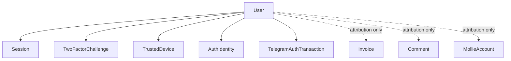

# Identity Domain

## Purpose

Staff authentication, session lifecycle, roles, two-factor authentication, and security audit
logging.

## Scope

- `User` — staff accounts (role `ADMIN`/`MANAGER`/`DOCTOR`).
- `Session` — login sessions.
- `TwoFactorChallenge`, `TrustedDevice` — 2FA flow.
- `AuthSecurityEvent` — security audit log.
- `AuthIdentity`, `TelegramAuthTransaction` — Telegram OIDC as an additional, ADMIN-only login
  provider (`server/src/modules/auth/telegram/`).
- CSRF, rate limiting, password hashing as supporting mechanisms.

## Out of Scope

- **Client identity.** `Client` (student/payer) never authenticates — no login endpoint, no
  password field, no session tied to a `Client` anywhere in the code. Client-facing "auth" doesn't
  exist; the public invoice view (Billing) uses an opaque token, not a login.
- Business meaning of *why* other domains reference `User` — those FKs
  (`Invoice.createdById`, `Comment.userId`, `MollieAccount.userId`, etc.) are plain
  staff-attribution links, documented in each owning domain, not identity logic.

## Entities

### User

- **Purpose**: a staff account.
- **Identity**: `id`.
- **Important fields**: `email` (unique), `role` (`ADMIN`/`MANAGER`/`DOCTOR`), `isEnabled`
  (real access gate, default `true`), `isActive` (default `false`, see note below), `authVersion`.
- **Relationships**: owns `Session[]`, `TwoFactorChallenge[]`, `TrustedDevice[]`,
  `AuthIdentity[]`, `TelegramAuthTransaction[]`; referenced by staff-attribution FKs across
  Billing, Payments, CRM.
- **States**: enabled/disabled via `isEnabled` (toggled by an `ADMIN` through `PATCH /users/:id`;
  an admin cannot disable their own account).
- **Invariants / notes**:
  - `isEnabled` is checked on every authentication and session-lookup path.
  - `isActive` is **not** an active gate today — every code path only ever reads it as a
    projected field or writes it via the Prisma default; nothing sets it explicitly and no
    permission check reads it. **Needs clarification** whether this is a planned "pending
    approval" flag that was never wired up.
  - Only `ADMIN` and `MANAGER` are checked anywhere in route guards. `DOCTOR` is a selectable role
    that currently gates nothing — no route, controller, or middleware references it. Documented
    as-is; no rationale for the name exists in code.

### Session

- **Purpose**: an active staff login.
- **Identity**: `id`; `refreshToken`/`tokenHash` are unique, hashed at rest.
- **Important fields**: `isRevoked`, `expiresAt`, `ipAddress`, `userAgent`.
- **Relationships**: belongs to one `User`.
- **States**: active → revoked (logout) or rotated (refresh).
- **Invariants**: refresh is an atomic delete-old/create-new transaction; if the delete doesn't
  affect exactly one row (already revoked/expired/reused), the request is rejected. The
  `SESSION_REUSE_DETECTED` audit event type exists in the schema and this guard's failure path
  matches its intent, but the event is **not currently emitted** on that path — the reuse is
  blocked, just not logged as that specific event type today.

### TwoFactorChallenge

- **Purpose**: bridges "password accepted" and "code confirmed." Does not grant access by itself.
- **Identity**: `id`; `tokenHash` unique.
- **Important fields**: `channel` (`EMAIL` only — `TELEGRAM` is reserved/unimplemented),
  `attempts`/`maxAttempts` (5), `resendCount` (capped at 3), `expiresAt` (10 minutes from
  creation), `consumedAt`.
- **Relationships**: belongs to one `User`.
- **States**: pending → confirmed (session issued) or locked (attempts exhausted) or expired.
- **Invariants**: resend cooldown is 60 seconds, computed from `updatedAt` (bumped on every
  resend) — not a separate cooldown field. Delivery is sent directly via nodemailer using the
  `EmailAccount` whose `username` matches `TWO_FACTOR_SENDER_EMAIL`, deliberately bypassing the
  Communication domain's email module so 2FA codes never appear as a client-facing `EmailMessage`.

### TrustedDevice

- **Purpose**: lets a known device skip the 2FA challenge on future logins.
- **Identity**: `id`; `tokenHash` unique.
- **Important fields**: `expiresAt` (30 days from creation).
- **Relationships**: belongs to one `User` — the trust cookie is bound to a specific account, so
  it cannot be used to skip 2FA for a different user on the same browser.

### AuthIdentity

- **Purpose**: a Telegram identity explicitly linked to a CRM `User`. Telegram never creates a
  `User` — this row only ever appears after an authenticated `ADMIN` completes the link flow, and
  login through Telegram only succeeds when a matching row already exists.
- **Identity**: `id`; `[provider, providerUserId]` unique — the real defense against two users
  racing to link the same Telegram identity (the link service also pre-checks, but the constraint
  is what's actually load-bearing under a race).
- **Important fields**: `provider` (`TELEGRAM` only today), `providerUserId` (Telegram's stable
  OIDC `sub`, never the `@username`), `username`/`displayName` (display-only metadata), `linkedAt`,
  `lastLoginAt`.
- **Relationships**: belongs to one `User`.
- **Invariants**: at most one `AuthIdentity` per `User` is enforced at the service layer
  (`auth.telegram.identity.service.ts`), not the schema — deliberately, so it can be relaxed later
  without a migration if a second provider or multi-identity need shows up.

### TelegramAuthTransaction

- **Purpose**: one row per in-flight Telegram OIDC authorization-code+PKCE exchange. Same role as
  `TwoFactorChallenge` — short-lived, single-use, does not grant access by itself.
- **Identity**: `id`; `state` unique (also carried in a `sameSite=lax` cookie scoped to the
  callback path, the same double-check `MollieOAuthState`/`mollie_oauth_state` already does for
  Mollie's OAuth flow).
- **Important fields**: `nonceHash` (HMAC, compared against the verified ID token's `nonce`
  claim), `codeVerifier` (PKCE, plaintext — must be replayed to Telegram's token endpoint, never
  exposed to a client), `flow` (`LOGIN`/`LINK`), `userId` (set at creation for `LINK`, bound to the
  already-authenticated caller server-side — never trusted from the callback; always `null` for
  `LOGIN`), `expiresAt` (5 minutes), `consumedAt`.
- **Relationships**: belongs to at most one `User` (`LINK` only).
- **Invariants**: the callback consumes a transaction via an `updateMany` guarded on
  `consumedAt: null`, mirroring `Session`'s refresh-transaction pattern — two requests racing on
  the same `state` cannot both succeed. Which flow (`LOGIN` vs `LINK`) a callback executes is read
  from this row, never from the callback URL or any client-supplied parameter.

### AuthSecurityEvent

- **Purpose**: append-only audit log of security-relevant actions (login success/failure/block,
  session lifecycle, 2FA outcomes, role/account changes).
- **Identity**: `id`.
- **Important fields**: `type` (large enum — see `user.prisma`), `actorUserId`, `targetUserId`,
  `metadata` (JSON).
- **Invariants**: never updated or deleted by any code path read for this documentation —
  append-only by convention.

## Domain Concepts

- **Login → 2FA → Session flow**: password check (with a constant-time dummy-hash comparison even
  when the user doesn't exist, to avoid a login-oracle timing leak) → if a valid `TrustedDevice`
  cookie exists (or `MODE=development`), skip straight to session issuance; otherwise create a
  `TwoFactorChallenge` and email a 6-digit code → on verification, issue the session and
  optionally create a `TrustedDevice`.
- **Password security**: Argon2id (`memoryCost=19*1024`, `timeCost=2`, `parallelism=1`); a legacy
  salted-hash fallback path exists for pre-migration accounts and transparently re-hashes to
  Argon2id on next successful login.
- **CSRF**: double-submit pattern — `GET /auth/csrf` returns an HMAC of the session token, the
  client echoes it in a header, compared with a constant-time check.
- **Rate limiting**: login is throttled 5 attempts/15 min per IP+email with a progressive delay
  before the hard limit; 2FA verify/resend is throttled 10 attempts/15 min per IP as a coarse
  secondary layer on top of the per-challenge attempt/resend counters. Backed by Redis when
  `REDIS_URL` is configured and reachable, otherwise an in-process fallback for the rest of the
  process lifetime once a Redis error occurs (no per-call retry).
- **Telegram login** (`server/src/modules/auth/telegram/`): an additional, **`ADMIN`-only** login
  provider (product decision, enforced server-side with an audit event on every denial — not just
  a hidden button) via Telegram's OIDC Authorization Code + PKCE flow
  (`https://oauth.telegram.org`). Linking (`GET /auth/telegram/link/start`, authenticated) must
  happen before login ever works; a verified Telegram identity with no matching `AuthIdentity` is
  denied, never auto-creates or auto-links a `User`. A Telegram-verified login replaces the
  password-entry step only — it still runs through the exact same trusted-device/2FA branch and
  `issueSession()` as password login, never bypassing 2FA. `POST`-shaped start endpoints are `GET`
  (full top-level browser navigation to Telegram and back, not an XHR — same shape as Mollie's
  `connectMollieController`), and `GET /auth/telegram/callback` is a single endpoint shared by both
  `LOGIN` and `LINK`, branching only on the server-side `TelegramAuthTransaction.flow`. Known
  limitation: `TrustedDevice`'s cookie is `sameSite=strict`, so it is never sent on the callback's
  cross-site-initiated redirect back from Telegram — a Telegram login therefore always falls
  through to the 2FA challenge, never the trusted-device bypass (fails safe, not currently fixed).

## Relationships

