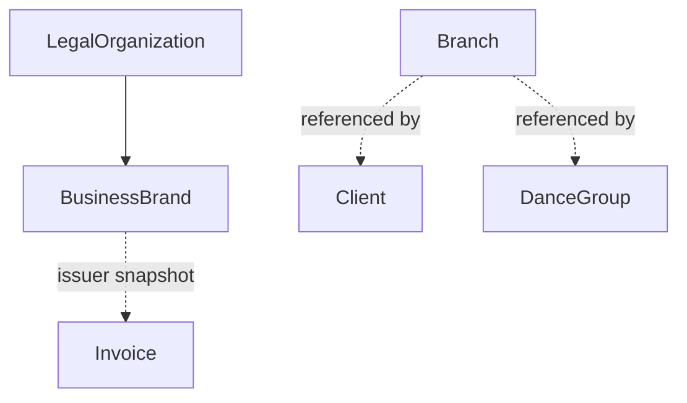

# Organization Domain

## Purpose

The studio's own structural/master data: legal entity, billing brands, and physical branches.
This is reference data consumed by other domains, not owned by any of them.

Not part of the task's starter domain list — added because `company.prisma` defines these models
with their own dedicated controller/router (`modules/company/company.controller.ts` /
`company.routes.ts`), distinct behavior (singleton legal entity, transactional default-brand
enforcement, soft-archive vs hard-delete), and consumers spanning three other domains. See
`docs/domain/README.md` for the justification summary.

## Scope

- `LegalOrganization` — the studio's legal/compliance identity.
- `BusinessBrand` — a billing-facing brand identity, used as invoice issuer.
- `Branch` — a physical studio location.

## Out of Scope

- Client records (CRM), invoicing logic (Billing), payment processing (Payments) — this domain
  supplies identity/reference data that those consume, it doesn't perform their behavior.

## Entities

### LegalOrganization

- **Purpose**: the studio's legal entity — used for compliance and as invoice issuer identity.
- **Identity**: `id`.
- **Important fields**: `legalName`, `kvkNumber`, `vatNumber`, `iban`, `mollieOrganizationId`.
- **Relationships**: has many `BusinessBrand`.
- **States**: none.
- **Invariants**: treated as a **singleton by controller convention**, not a schema constraint —
  `getOrganization`/`upsertOrganization` always operate on `findFirst(orderBy: id asc)`; nothing
  in the schema prevents a second row from being created outside this controller.
  `syncOrganizationFromMollie` fills fields from the connected Mollie profile **only where the
  existing value is falsy** — manually entered data always wins over a later Mollie sync, it's
  never overwritten.

### BusinessBrand

- **Purpose**: a billing-facing brand (name, logo, color, contact info) used as the issuer on
  invoices. Supports multi-brand billing under one legal entity.
- **Identity**: `id`; `slug` unique.
- **Important fields**: `organizationId`, `isDefault`, `isActive`, `mollieProfileId`.
- **Relationships**: belongs to `LegalOrganization`; referenced by `Invoice.businessBrandId`
  (Billing snapshots brand fields onto the invoice at issue time — see `billing.md`).
- **States**: active ⇄ archived (`isActive: false`). **Never hard-deleted** — there is no
  `businessBrand.delete` call anywhere in the controller; "delete" in the API is always an archive.
- **Invariants**: exactly one brand per organization may have `isDefault: true`, enforced
  transactionally — setting a brand as default first clears the flag on every other brand in the
  same organization inside one `$transaction`, not left to convention alone.

### Branch

- **Purpose**: a physical studio location.
- **Identity**: `id`.
- **Important fields**: `name`, `address`, `city`, `isActive`.
- **Relationships**: referenced by `Client.branchId` (CRM) and `DanceGroup.branchId` (Scheduling).
- **States**: `isActive` field exists but is **not enforced as a lifecycle gate** — nothing blocks
  deleting or reassigning an "active" branch.
- **Invariants**: **hard-deletable** (plain `branch.delete`) — asymmetric with `BusinessBrand`'s
  soft-archive pattern. No cross-check against in-use branches (e.g. clients or groups still
  pointing at it) was found in this controller.

## Domain Concepts

- **Mollie fields are currently write-only beyond storage.** `LegalOrganization.mollieOrganizationId`
  and `BusinessBrand.mollieProfileId` are populated by `syncOrganizationFromMollie`, but no other
  code path in the repository reads them back to route a Mollie API call or select a payment
  profile. **Needs clarification** whether `mollieProfileId` is meant to route Payments-domain
  behavior in the future.

## Relationships

