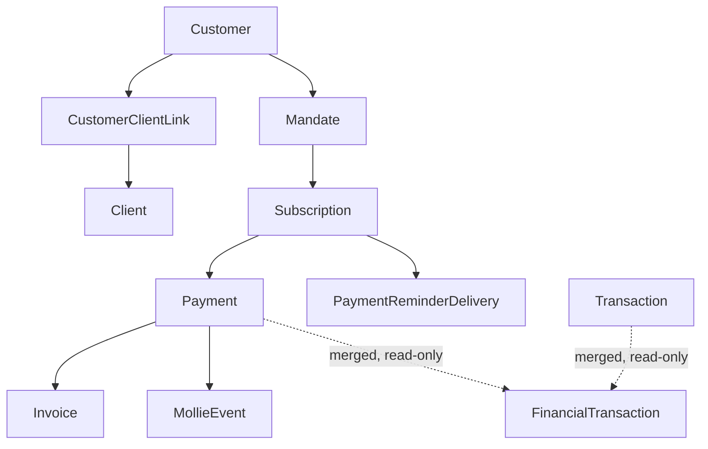

# Payments Domain

## Purpose

The Mollie payment gateway integration (customers, mandates, subscriptions, payments, webhooks),
reconciliation/incident surfacing, recurring-subscription payment reminders, and the internal
cash-flow ledger.

## Scope

- `MollieAccount`, `MollieOAuthState` — staff OAuth connection to Mollie.
- `MollieIncidentResolution` — manual acknowledgement log for reconciliation incidents.
- `Customer`, `CustomerClientLink` — Mollie payer profiles and their link to `Client`.
- `Mandate`, `Subscription`, `Payment`, `MollieEvent` — recurring authorization, plans, individual
  transactions, and webhook event log.
- `InvoiceMolliePaymentLink` — schema-owned by Billing, but populated/reconciled from here.
- `Transaction` — internal manual cash bookkeeping, merged with Mollie payments into a reporting
  ledger.
- `PaymentReminderSettings`, `PaymentReminderDelivery`, `PaymentReminderTemplate` — reminders
  about **upcoming recurring subscription charges** (distinct from Billing's invoice reminders).

## Out of Scope

- Invoice numbering/status — Billing owns `Invoice`; this domain only writes `Payment` rows and
  updates `InvoiceMolliePaymentLink` status.
- Organization identity configuration — `LegalOrganization`/`BusinessBrand` and their stored
  `mollieOrganizationId`/`mollieProfileId` fields belong to Organization, even though the live
  Mollie API calls happen here.
- **Invoice reminders** (`REMINDER_BEFORE_DUE`/`REMINDER_OVERDUE`) — a separate mechanism owned by
  Billing. See the disambiguation in [GLOSSARY.md](GLOSSARY.md).

## Entities

### Customer

- **Purpose**: a Mollie-side payer profile (may or may not be a `Client`).
- **Identity**: `id`; `mollieId` unique (`cst_...`).
- **Important fields**: `clientId` — a **denormalized cache** of whichever `CustomerClientLink` is
  currently primary, kept in sync automatically when the primary link changes. It is not the
  source of truth.
- **Relationships**: `CustomerClientLink[]`, `Mandate[]`, `Subscription[]`, `Payment[]`.

### CustomerClientLink

- **Purpose**: the real many-to-many relation between a payer (`Customer`) and student(s)
  (`Client`) — exists because one payer (e.g. a parent) can fund multiple students.
- **Identity**: `id`; unique on `(customerId, clientId)`.
- **Important fields**: `payerRelation` (e.g. parent/self/unknown), `linkSource`
  (`'manual'`/`'email_match'`/`'unlinked'`), `isPrimary`.
- **Invariants**: at most one link per `Customer` should be primary at a time; `Customer.clientId`
  is overwritten to mirror the current primary link (or nulled out if none remains) whenever links
  change.

### Mandate

- **Purpose**: a recurring payment authorization tied to a `Customer`.
- **Identity**: `id`; `mollieId` unique (`mdt_...`).
- **Relationships**: has many `Subscription`. No code found restricting a mandate to a single
  subscription — reuse across subscriptions is schema-permitted and not guarded against.

### Subscription

- **Purpose**: a recurring payment plan tied to a `Mandate`/`Customer`.
- **Identity**: `id`; `mollieId` unique (`sub_...`).
- **Important fields**: `nextPaymentDate`, `status`.
- **Relationships**: `Payment[]`, `PaymentReminderDelivery[]`.

### Payment

- **Purpose**: a single Mollie transaction.
- **Identity**: `id`; `mollieId` unique (`tr_...`).
- **Important fields**: `status`, `refundedAmount`, `chargedBackAmount`, `isCancelable`.
- **Relationships**: optional `Customer`, optional `Subscription`, optional `Invoice`
  (Billing) — may be linked to neither, either, or both of the latter two. `MollieEvent[]`.
- **Invariants**: **Needs clarification** — `isCancelable` exists on the model but a guard reading
  it before the cancel-payment action was not confirmed in the code reviewed for this pass.

### MollieEvent

- **Purpose**: the webhook event log.
- **Identity**: `id`; `dedupeKey` unique.
- **Important fields**: `processingStatus` (`received` → `processed`/`failed`),
  `molliePaymentId`, `payload`.
- **Invariants**: `dedupeKey` is a **composite, content-based key** — payment id + normalized
  status + `paidAt` + refunded/charged-back amounts — not just the payment id. A resend of the
  identical state collides on the unique constraint and is treated as already-processed (no
  reprocessing); a genuinely new status/amount for the same payment produces a new key and is
  processed as a new event. On processing failure, `dedupeKey` is cleared so a retry isn't
  permanently blocked.

### InvoiceMolliePaymentLink

- Schema-owned by Billing (see `billing.md`); the webhook handler here resolves an incoming
  `invoicePaymentLinkToken` to mark the corresponding link paid/archived and to associate the
  synced `Payment` with the right `Invoice`.

### Transaction

- **Purpose**: manual, internal cash bookkeeping (income/expense) for the studio — unrelated to
  client invoicing. See `schema.prisma`.
- **Identity**: `id`.
- **Important fields**: `type` (`INCOME`/`EXPENSE`), `amount`, `category`, `paymentMethod`.

## Domain Concepts

- **Incident (Mollie)**: not a stored entity — a **derived query** at request time:
  - *payment* incident: `Payment.status` in `failed`/`canceled`/`expired`/`charged_back`.
  - *subscription* incident: a live subscription (`active`/`pending`/`suspended`) with no mandate,
    or a mandate that isn't `valid`.
  - *customer* incident: no email, or zero client links.
  "Resolving" an incident writes a `MollieIncidentResolution` row keyed by `incidentKey`
  (e.g. `"payment-42"`) that excludes it from future incident queries — it's an acknowledgement,
  not a fix; the underlying record is untouched.
- **Payment reminders (Subscription-based)**: `selectSubscriptionsDueForReminder` queries
  `Subscription.nextPaymentDate` within a configurable window (`offsetDays`), excluding
  subscriptions with an invalid mandate, and writes one `PaymentReminderDelivery` per
  `(subscriptionId, targetPaymentDate)` (unique constraint prevents duplicates). This is "your
  recurring payment is coming up on date X" — it has **no relationship to `Invoice`**. Confirmed
  entirely separate from Billing's `InvoiceDelivery` reminder types.
- **Financial ledger merge (`FinancialTransaction`)**: a **read-only reporting view**, not a stored
  entity, that merges manual `Transaction` rows with synced Mollie `Payment` rows (paid, or
  refunded/charged-back, which also produce separate "reversal" entries) into one list tagged
  `source: 'MANUAL' | 'MOLLIE'`. Nothing is written back to `Payment` from this merge.
- **Mollie connection is operationally shared, not per-user**: `MollieAccount` is architecturally
  per-`User` (`userId` unique, full OAuth token pair per account), but the connection-status check
  used elsewhere in the app queries the most-recently-updated *active* account regardless of which
  staff member it belongs to — in practice, one shared Mollie connection serves the whole CRM. A
  static API-key fallback mode also exists (`MOLLIE_API_KEY`/`MOLLIE_API_KEY_LIVE` env vars) when
  no OAuth account is active.

## Relationships

