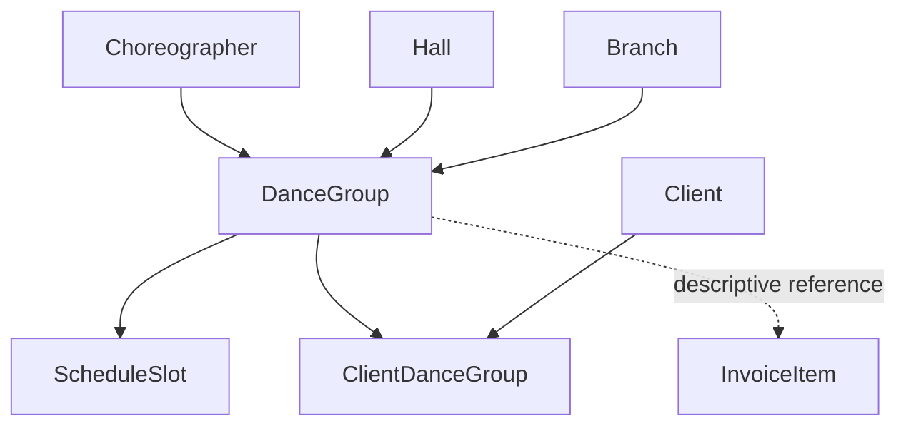

# Scheduling Domain

## Purpose

Manage classes (dance groups), instructors, rooms, weekly time slots, and the public dance-style
catalog.

## Scope

- `DanceGroup` — a class (style + level + choreographer + hall + branch + price).
- `Choreographer` — an instructor.
- `Hall` — a room.
- `ScheduleSlot` — a weekly recurring time slot for a group.
- `DanceStyle` — a public-site content catalog of styles (separate from `DanceGroup.style`).
- `ClientDanceGroup` — the client↔group enrollment bridge table (schema-owned here, but see the
  ownership note below — it is not written by this domain's controller).

## Out of Scope

- Pricing computation for invoices — Billing never reads `DanceGroup.lessonPriceCents`; invoice
  line prices are supplied independently by the caller.
- Client identity and enrollment *writes* — see Domain Concepts below.
- Branch/organization structure (Organization) — Scheduling only stores a `branchId` reference.

## Entities

### DanceGroup

- **Purpose**: a recurring class.
- **Identity**: `id`.
- **Important fields**: `name`, `style` (free text), `level` (`START`/`FAN`/`PRO`),
  `maxParticipants` (default 20), `lessonPriceCents`, `choreographerId`, `hallId`, `branchId`.
- **Relationships**: `Choreographer`, `Hall`, `Branch` (Organization), `ScheduleSlot[]`,
  `InvoiceItem[]` (Billing, descriptive only), `ClientDanceGroup[]` (CRM-owned writes).
- **States**: none — no archive/active lifecycle field on this model.
- **Invariants**:
  - `lessonPriceCents` must be a non-negative integer; `name`/`style`/`choreographerId`/`branchId`
    are required on create.
  - `maxParticipants` is stored and even summed into branch-level capacity stats, but **is never
    enforced** anywhere in code — no check blocks a group (or a client's enrollment into it) from
    exceeding it. Document it as informational, not a hard limit.
  - Deleting a group is a plain delete; `ScheduleSlot` removal on group delete relies on the
    schema's `onDelete: Cascade`, not explicit application code.

### Choreographer

- **Purpose**: an instructor who teaches one or more groups.
- **Identity**: `id`.
- **Important fields**: `firstName`/`lastName` (+ UA/EN variants), `category` (a `GroupLevel`
  value), `showOnSite`.
- **Relationships**: `DanceGroup[]`.

### Hall

- **Purpose**: a physical room used to schedule groups.
- **Identity**: `id`. **Important fields**: `name`, `capacity`.
- **Invariants**: no update endpoint exists for `Hall` (only create/list/delete) — a naming or
  capacity correction requires delete+recreate.

### ScheduleSlot

- **Purpose**: a weekly recurring time slot for a group (e.g. "Tuesday 18:00–19:00").
- **Identity**: `id`; belongs to one `DanceGroup`.
- **Important fields**: `dayOfWeek`, `startTime`, `endTime` — all plain strings, not
  enums/time types, and no format validation was found in the controller.
- **Invariants**: fully **replace-on-write** — updating a group's slots deletes all existing slots
  for that group and recreates them from the submitted payload. **No overlap/double-booking check**
  exists for a hall or choreographer across groups.

### DanceStyle

- **Purpose**: a public-site content catalog entry (translations, images, YouTube link) for a
  dance style.
- **Identity**: `id`. **Important fields**: `name` (+ UA/EN), `isActive`.
- **Invariants**: this is a **separate catalog** from `DanceGroup.style` (free text) — the styles
  endpoint unions both sets, so a group's style string is not required to match any `DanceStyle`
  row.

## Domain Concepts

- **GroupLevel** (`START`/`FAN`/`PRO`): the same tri-level used for the Start/Fan/Pro UI badge
  convention documented in `.claude/rules/code-style.md` — a confirmed, stable domain concept.
- **Enrollment ownership**: `ClientDanceGroup` rows are created and replaced entirely inside CRM's
  `service.Clients.ts` (client create/update), using the same replace-all pattern as
  `ScheduleSlot` — **not** by any endpoint in `controller.Schedule.ts`. If you're changing
  enrollment behavior, look in the CRM domain, not here. Scheduling's only enrollment-adjacent
  code is a stats endpoint (`getGroupManagementStats`) that reads `ClientDanceGroup` rows written
  by CRM.

## Relationships

